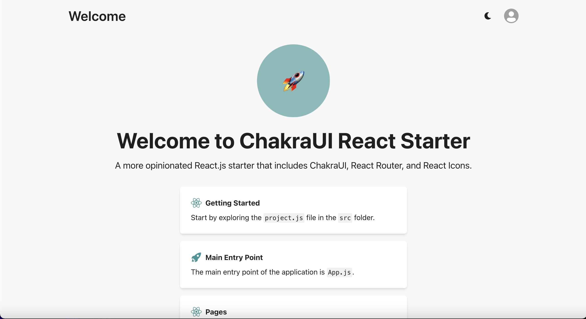

# ChakraUI React Starter

A more opinionated React.js starter that includes ChakraUI, React Router, and React Icons. I just created this project because I find myself wasting hours on boilerplate UI code when building new things, so I'll just use this template instead.



## Getting Started

Clone the repo and install dependencies:

```bash
git clone git@github.com:spencerkinney/chakraui-react-starter.git
cd chakraui-react-starter
npm install
```

Start the development server:

```
npm start
```

Open [http://localhost:3000](http://localhost:3000) to view it in the browser.

## Using for Your Own Project

To use this starter for your own project:

1. Remove the existing remote:

```
rm -rf .git
```

2. Initialize a new Git repo:

```
git init
```

3. Create a new repo on GitHub (or your preferred platform)

4. Add the new remote:

```
git remote add origin https://github.com/your-username/your-repo.git
```

5. Commit and push your changes:

```
git add .
git commit -m "Initial commit"
git push origin main
```

Now you can start modifying the code for your own project!

## Overview

- **ChakraUI** for UI components
- **React Router** for routing
- **React Icons** for icons
- Simple Authentication flow (login, register, logout)
- `src/pages` for main pages
- `src/util` for reusable components
- `src/api` for API functions
- `src/theme.js` for ChakraUI theme
- `src/project.js` for project constants

## Contributing

Open an issue or submit a PR.

## License

[MIT](LICENSE)